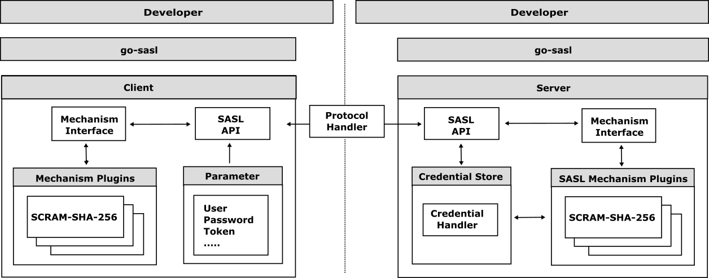

# go-sasl


[](https://github.com/cybergarage/go-sasl/actions/workflows/make.yml)
[](https://pkg.go.dev/github.com/cybergarage/go-sasl)
 [](https://goreportcard.com/report/github.com/cybergarage/go-sasl) 
 [](https://codecov.io/gh/cybergarage/go-sasl)

The `go-sasl` is a client and server framework for implementing [Simple Authentication and Security Layer (SASL)](https://datatracker.ietf.org/doc/html/rfc4422) authentication in Go. 
[SASL](https://datatracker.ietf.org/doc/html/rfc4422) is a framework for authentication and data security in Internet protocols. It decouples authentication mechanisms from application protocols, allowing any authentication mechanism to be used with any protocol. SASL provides a structured interface for adding authentication support to connection-based protocols.　The `go-sasl` provides a common [SASL](https://datatracker.ietf.org/doc/html/rfc4422) mechanism interface for the client and server as the following:




SASL mechanisms are responsible for the authentication process, which can include steps such as exchanging credentials, verifying identities, and establishing secure communication channels. Each mechanism defines its own protocol for these steps, allowing for flexibility and extensibility.

## Getting Started

### Mechanism Negotiation

The client and server negotiate the SASL mechanism to use during the authentication process. The client sends a list of supported mechanisms to the server, which selects one and returns it to the client. The client then initializes the selected mechanism and begins the authentication process.

SASL mechanisms are named by character strings, such as `PLAIN` and `SCRAM-SHA-256`. The `go-sasl` client and server can find mechanisms by name using `Server::Mechanism()` and `Client::Mechanism()`.  The `go-sasl` provides the following mechanism plugins:

- [ANONYMOUS](https://datatracker.ietf.org/doc/html/rfc4505)
- [PLAIN](https://datatracker.ietf.org/doc/html/rfc4616)
- [SCRAM-SHA-1](https://datatracker.ietf.org/doc/html/rfc5802)
- [SCRAM-SHA-256](https://datatracker.ietf.org/doc/html/rfc7677)
- [SCRAM-SHA-512 (Draft)](https://datatracker.ietf.org/doc/draft-melnikov-scram-sha-512/)

### Mechanism Interface

The `go-sasl` provides a common [SASL](https://datatracker.ietf.org/doc/html/rfc4422) API as the following [Mechanism](https://github.com/cybergarage/go-sasl/blob/main/sasl/mech/mechanism.go) interface for the client and server.

```go
// Context represents a SASL mechanism context.
type Context interface {
    // Next returns the next response.
    Next(...Parameter) (Response, error)
    // Step returns the current step number. The step number is incremented by one after each call to Next.
    Step() int
    // IsCompleted returns true if the context is completed.
    IsCompleted() bool
    // Dispose disposes the context.
    Dispose() error
}

// Mechanism represents a SASL mechanism.
type Mechanism interface {
    // Name returns the mechanism name.
    Name() string
    // Type returns the mechanism type.
    Type() Type
    // Start returns the initial context.
    Start(...Option) (Context, error)
}
```
### Example

#### Server

The following pseudo example demonstrates how to authenticate client messages for SCRAM-SHA-256 mechanism using the `go-sasl` server. For more complete examples, see go-sasl mechanism plugin testing, [TestMechanism()](https://github.com/cybergarage/go-sasl/blob/main/sasltest/mech/plugin_test.go).

```go
package main

import (
  "github.com/cybergarage/go-sasl/sasl"
)

func main() {

  server := sasl.NewServer()

  // Receive CRAM-SHA-256 mechanism negotiation from the client.  
  mechName := ... // "SCRAM-SHA-256"
  mech, err := server.Mechanism(mechName)
  if err != nil {
    return
  }
  serverOpts := []mech.Option{...}
  ctx, err := mech.Start(serverOpts...)
  if err != nil {
    return
  }

  // Check the first authentication message from the client.
  // ex. "n,,n=user,r=fyko+d2lbbFgONRv9qkxdawL"
  clientFirstMsg := ...　
  serverFirstMsg, err := mech.Next(clientFirstMsg)
  if err != nil {
    // Send the error message to the client.
    ....
    return
  }

  // Send the first server authentication message to the client.
  // ex. "r=fyko+d2lbbFgONRv9qkxdawL,s=QSXCR+Q6sek8bf92"
  serverFirstMsgBytes := serverFirstMsg.Bytes()
  ...

  // Check the final authentication message from the client.
  // ex. "c=biws,r=fyko+d2lbbFgONRv9qkxdawL,p=v0X8v3Bz2T0CJGbJQyF0X+HI4Ts="
  clientFinalMsg := ... 
  finalServerMsg, err := mech.Next(clientFinalMsg)
  if err != nil {
    // Send the error message to the client.
    ....
    return
  }

  // Send the final server message to the client.
  // ex. "v=rmF9pqV8S7suAoZWja4dJRkFsKQ="
  serverFinalMsgBytes := finalServerMsg.Bytes()
  ....

  // Dispose the mechanism context.
  ctx.Dispose()
  
```


## References

- [RFC 4422: Simple Authentication and Security Layer (SASL)](https://datatracker.ietf.org/doc/html/rfc4422)
  - [RFC 2743: Generic Security Service Application Program Interface Version 2, Update 1](https://datatracker.ietf.org/doc/html/rfc2743)
  - [RFC 2898: PKCS #5: Password-Based Cryptography Specification Version 2.0](https://datatracker.ietf.org/doc/html/rfc2898)
  - [RFC 4013: SASLprep: Stringprep Profile for User Names and Passwords](https://datatracker.ietf.org/doc/html/rfc4013)
  - [RFC 4086: Randomness Requirements for Security](https://datatracker.ietf.org/doc/html/rfc4086)

- [Simple Authentication and Security Layer (SASL) Mechanisms](https://www.iana.org/assignments/sasl-mechanisms/sasl-mechanisms.xhtml)
  - [RFC 4505: Anonymous Simple Authentication and Security Layer (SASL) Mechanism](https://www.rfc-editor.org/rfc/rfc4505.html)
  - [RFC 4616: The PLAIN Simple Authentication and Security Layer (SASL) Mechanism](https://datatracker.ietf.org/doc/html/rfc4616)
  - [RFC 5801: Using Generic Security Service Application Program Interface (GSS-API) Mechanisms in Simple Authentication and Security Layer (SASL): The GS2 Mechanism Family](https://www.rfc-editor.org/rfc/rfc5801)
  - [RFC 5802: Salted Challenge Response Authentication Mechanism (SCRAM) SASL and GSS-API Mechanisms](https://datatracker.ietf.org/doc/html/rfc5802)
    - [RFC 7677: SCRAM-SHA-256 and SCRAM-SHA-256-PLUS Simple Authentication and Security Layer (SASL) Mechanisms](https://datatracker.ietf.org/doc/html/rfc7677)
